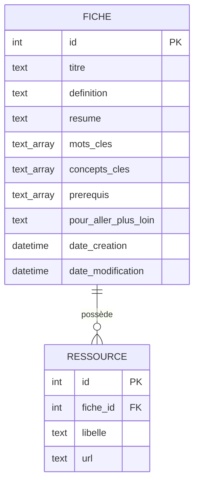

# Cahier des charges (mini) — Moteur de recherche intelligent orienté apprentissage

*Nom du projet : à définir (étape 13, avant la création du dépôt GitHub)*
*Version : 1.0 — Document de référence de la v1*
*Auteur : Franck Armel Tague Saah*

## 1. Contexte

Franck Armel Tague Saah, développeur full-stack (Java/Python/React), souhaite concevoir et développer un projet complet, de A à Z, pour consolider en profondeur ses compétences en architecture logicielle et en conception de moteurs de recherche. Le projet est indépendant (pas lié aux données réelles d'une entreprise), mais construit avec la rigueur d'un vrai projet professionnel, dans l'optique d'être présenté sur un CV et un portfolio.

## 2. Besoin

- **Situation** : un utilisateur cherche à comprendre un sujet informatique (technologie, langage, outil, concept), pas seulement à trouver des liens.
- **Problème** : une recherche classique renvoie souvent des informations nombreuses, mais dispersées, redondantes ou trop techniques — trouver de l'information ne veut pas dire la comprendre.
- **Objectif** : transformer une recherche en point de départ de compréhension structurée d'un sujet, sur un domaine pilote informatique pour la v1, avec une architecture pensée dès le départ pour être étendue à l'IA et, plus tard, à d'autres domaines.
- **Persona v1** : un utilisateur unique — une personne qui tape un terme ou une question informatique et veut une réponse compréhensible, pas une simple liste de résultats bruts.

## 3. Objectifs du projet

1. Produire un moteur de recherche fonctionnel, structuré, testé et documenté.
2. Être capable, à la fin, d'expliquer précisément : le besoin, l'architecture, le flux de données, le fonctionnement de la recherche (et plus tard de l'IA), les choix techniques, l'organisation du projet et son historique Git.

## 4. Fonctionnalités — Version 1 (dans le périmètre)

- Recherche par mot-clé : l'utilisateur tape un terme, le système le compare au titre, aux mots-clés et à la description des fiches en base (comparaison textuelle simple, sans compréhension du sens).
- Affichage d'une fiche correspondante avec ses champs pré-rédigés par Franck : définition claire, concepts clés/prérequis, texte "pour aller plus loin", résumé court, ressources liées.
- Message "aucun résultat" si aucune fiche ne correspond.
- Tri par pertinence : une correspondance dans le titre prime sur une correspondance dans les mots-clés, qui prime elle-même sur une correspondance uniquement dans la description.
- Interface web React basique : champ de recherche, liste de résultats, page de détail par fiche.
- Contenu initial : environ 20 fiches informatiques, rédigées par Franck, en une seule langue (français), ajoutées directement en base via scripts SQL (pas d'interface d'administration).
- Utilisateur unique, sans compte ni authentification.
- Exécution en environnement de développement local.

## 5. Hors périmètre v1 (backlog)

- Intelligence artificielle et NLP : compréhension du sens, génération de définitions/résumés, recherche sémantique, recommandations, parcours d'apprentissage personnalisé.
- Autocomplétion, tolérance aux fautes de frappe, synonymes.
- Historique de recherche, recherches populaires.
- Authentification, comptes utilisateurs, monétisation — prévu pour une phase ultérieure (étape 27 : sécurité), une fois le moteur fonctionnel. L'architecture sera conçue pour permettre cette extension sans réécriture majeure.
- Interface d'administration pour la gestion des fiches.
- Autres domaines que l'informatique.
- Déploiement en production, CI/CD avancé.
- Quiz/tests de compréhension.

## 6. Contraintes techniques

- **Backend** : Python, Flask, API REST.
- **Base de données** : PostgreSQL.
- **Frontend** : React.js.
- **Versionnement** : Git / GitHub, avec un historique de commits qui reflète la progression réelle du projet.
- Toute technologie additionnelle (Elasticsearch/OpenSearch, Redis, Docker, CI/CD, embeddings, LLM) ne sera introduite que lorsqu'un besoin réel et compris la justifiera.
- Le backend suivra une architecture en couches (routes/controllers, services, repositories, modèles, DTO/schémas, configuration, gestion centralisée des erreurs, validation, tests) — pas de logique métier directement dans les routes Flask.

## 7. Méthode de travail

Le projet est mené en mode mentorat technique. Pour chaque fonctionnalité :

Besoin → Analyse → Conception → Choix technique → Architecture → Implémentation → Explication → Tests → Commit Git → Push

Aucune fonctionnalité n'est codée avant d'avoir été comprise. Franck rédige lui-même certaines parties (spécifications, parfois du code) avant relecture et correction.

## 8. Acteur et User Stories (v1)

**Acteur unique** : Visiteur (utilisateur non authentifié).

- **US01 — Rechercher une notion informatique** : en tant que visiteur, je veux rechercher un mot-clé informatique (ex. un terme technique), afin de retrouver rapidement les fiches qui en parlent.
- **US02 — Consulter les résultats de recherche** : en tant que visiteur, je veux consulter les résultats correspondant à ma recherche, afin de trouver rapidement l'information la plus pertinente.
- **US03 — Consulter le détail d'une fiche** : en tant que visiteur, je veux consulter le détail d'une fiche (définition, résumé, concepts clés, prérequis et ressources liées), afin de comprendre et approfondir le sujet recherché.
- **US04 — Être informé lorsqu'aucun résultat n'est trouvé** : en tant que visiteur, je veux être clairement informé lorsqu'aucune fiche ne correspond à ma recherche, afin de comprendre que le moteur n'a trouvé aucun contenu correspondant et pouvoir effectuer une nouvelle recherche.

## 9. Conception fonctionnelle (étape 8)

Pour chaque User Story : données nécessaires, déroulé, règles métier — avant toute décision technique.

**US01 — Rechercher une notion informatique**
- *Données* : titre, mots-clés, description de chaque fiche.
- *Déroulé* : le visiteur saisit un terme → envoyé au backend → le backend interroge PostgreSQL sur titre/mots-clés/description → liste des fiches correspondantes (ou vide) renvoyée.
- *Règles métier* : recherche insensible à la casse et aux accents.

**US02 — Consulter les résultats de recherche**
- *Données par résultat* : titre, courte description/extrait, mots-clés (optionnel), identifiant permettant d'ouvrir la fiche complète.
- *Déroulé* : le frontend reçoit la liste → l'affiche (titre + aperçu) → le visiteur clique sur un résultat pour ouvrir la fiche détaillée.
- *Règles métier (tri par pertinence)* : 1) correspondance dans le titre, 2) correspondance dans les mots-clés, 3) correspondance uniquement dans la description.

**US03 — Consulter le détail d'une fiche**
- *Données* : titre, définition, résumé, concepts clés, prérequis, section "pour aller plus loin", ressources liées (optionnelles), mots-clés.
- *Déroulé* : clic sur un résultat → ouverture de la page de détail → affichage du contenu complet → possibilité de revenir aux résultats ou de lancer une nouvelle recherche.
- *Règles métier* : titre et définition obligatoires ; concepts clés et prérequis distincts (champs séparés) ; ressources liées optionnelles ; une section vide ne s'affiche pas ; contenu v1 uniquement issu de la base, jamais généré automatiquement.

**US04 — Être informé lorsqu'aucun résultat n'est trouvé**
- *Données* : la requête saisie, l'information "aucune fiche trouvée".
- *Déroulé* : recherche lancée → aucune correspondance → message explicite affiché (reprenant la requête) → champ de recherche toujours disponible pour relancer une recherche.
- *Règles métier* : l'absence de résultat n'est pas une erreur technique (fonctionnel, pas un bug) ; jamais de message technique brut (backend/BDD) affiché au visiteur.

**Notes pour l'étape 9 (conception BDD)**, issues des règles métier ci-dessus :
- Champs obligatoires sur une fiche : titre, définition.
- Champs optionnels : ressources liées.
- Champs à garder distincts (pas fusionnés) : concepts clés, prérequis.
- Aucun champ ne doit contenir de contenu généré : tout est saisi par Franck.

## 10. Conception de la base de données (étape 9)

**Table `fiche` (v1)**

| Colonne | Type | Obligatoire | Rôle |
|---|---|---|---|
| id | identifiant unique (clé primaire) | Oui | Identifiant de la fiche |
| titre | texte | Oui | Nom du sujet |
| definition | texte | Oui | Explication principale |
| resume | texte | Oui | Résumé court |
| pour_aller_plus_loin | texte | Non | Contenu d'approfondissement |
| date_creation | date/heure | Oui | Date de création |
| date_modification | date/heure | Oui | Dernière modification |

**Mots-clés, concepts clés, prérequis** : stockés comme des colonnes de type *tableau de texte* directement sur `fiche` (`mots_cles`, `concepts_cles`, `prerequis`). Raison : ce sont de simples valeurs atomiques (une seule information chacune), et rien dans le périmètre v1 ne nécessite de les interroger indépendamment d'une fiche (pas de "parcours" reliant les fiches entre elles pour l'instant — ça viendra avec l'IA, en backlog). Une colonne simple suffit et reste facile à faire évoluer plus tard.

**Ressources liées** : table séparée `ressource`, liée à `fiche` par une clé étrangère. Raison : contrairement aux précédents, une ressource porte **deux informations propres** (un libellé et une URL), et une fiche peut en avoir plusieurs — c'est le signal classique qu'il faut sa propre table plutôt qu'une colonne.

| Colonne | Type | Obligatoire | Rôle |
|---|---|---|---|
| id | identifiant (clé primaire) | Oui | Identifiant de la ressource |
| fiche_id | clé étrangère → fiche.id | Oui | Fiche à laquelle la ressource appartient |
| libelle | texte | Oui | Nom affiché du lien |
| url | texte | Oui | Adresse de la ressource |

**Schéma final (étape 9 close)**



## 11. Architecture logicielle (étape 11-12)

**Frontend (React)** : interface utilisateur uniquement (recherche, résultats, détail). Ne communique avec le backend que via des appels HTTP (API REST) — il ne connaît jamais PostgreSQL directement.

**Backend (Flask), en couches :**
- *Routes/Controllers* : reçoivent les requêtes HTTP, appellent les services, renvoient du JSON — aucune logique métier ici.
- *Services* : la logique métier (ex. appliquer le tri par pertinence, décider de la réponse si aucun résultat).
- *Repositories* : seule couche qui parle à PostgreSQL. Le reste de l'application ignore comment les données sont stockées.
- *Modèles* : représentent les données (Fiche, Ressource).
- *Schémas* : définissent le format exact des données échangées en JSON avec le frontend.
- *Config* : variables d'environnement, séparées du code.

**Pourquoi cette séparation** : chaque couche peut être testée, remplacée ou étendue sans toucher aux autres — c'est ce qui permettra d'ajouter l'IA ou l'authentification plus tard (nouveaux services) sans réécrire le moteur de recherche.

**Arborescence backend proposée**
```
backend/
├── app/
│   ├── __init__.py
│   ├── config.py
│   ├── models/fiche.py
│   ├── repositories/fiche_repository.py
│   ├── services/recherche_service.py
│   ├── schemas/fiche_schema.py
│   ├── routes/recherche_routes.py
│   └── errors/handlers.py
├── tests/
├── requirements.txt
└── run.py
```

**Arborescence frontend proposée**
```
frontend/
├── src/
│   ├── components/ (SearchBar, ResultList, FicheDetail)
│   ├── pages/ (HomePage, FichePage)
│   ├── services/api.js
│   └── App.jsx
├── package.json
```

## 12. Suite du projet (aperçu)

Étapes suivantes une fois ce document validé : identification des acteurs et rédaction des User Stories (étape 6-7), conception fonctionnelle et base de données (étape 8-10), choix de l'architecture détaillée (étape 11-12), puis initialisation Git/GitHub (étape 13) et développement.
